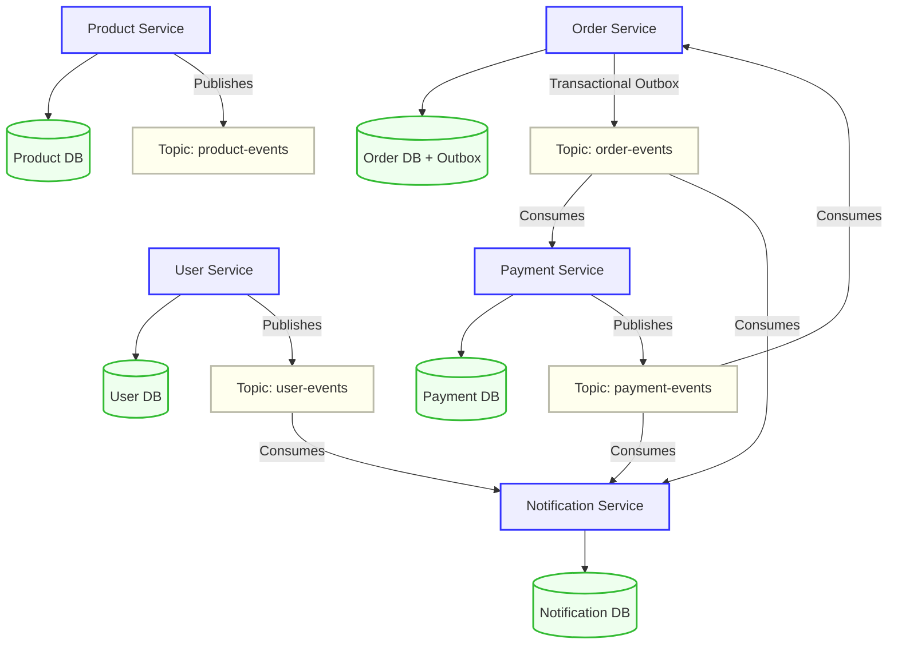

# Enterprise Event-Driven Microservices Architecture

[](https://www.oracle.com/java/technologies/javase/jdk17-archive-downloads.html)
[](https://spring.io/projects/spring-boot)
[](https://kafka.apache.org/)
[](https://www.postgresql.org/)
[](https://www.docker.com/)
[](https://maven.apache.org/)

An enterprise-grade, highly resilient **Event-Driven Microservices Architecture** built using **Spring Boot 3.x**, **Apache Kafka**, and **PostgreSQL**. The system is designed to simulate a real-world e-commerce environment implementing cutting-edge distributed systems patterns, including the **Transactional Outbox Pattern** for guaranteed eventual consistency, and a **Choreography-based Saga Pattern** to handle asynchronous distributed transactions.

---

## 🏗️ Architecture Design & Message Flow

The system consists of five decoupled, autonomous microservices that communicate asynchronously using high-performance Kafka topics. Data isolation is strictly maintained—each microservice owns its own database, preventing tight database-level coupling.



---

## 🌟 Key Technical Patterns Highlighted

### 1. Transactional Outbox Pattern (Guaranteed Event Delivery)
To solve the **"Dual-Write" problem** (updating a database and publishing to Kafka atomically), the `order-service` saves the `Order` record and an `OutboxEvent` (JSON payload) in the **same database transaction**. 
* A background `@Scheduled` runner (`OutboxPublisher`) polls the database, publishes unsent events to Kafka, and marks them `processed = true` on success.
* **At-Least-Once Delivery** is guaranteed. If Kafka goes down, no events are lost—they wait securely in the database outbox and auto-publish when Kafka recovers.

### 2. Choreography-Based Saga (Distributed Transactions)
We handle order processing and payment resolution asynchronously:
* `OrderService` places order in `PENDING` -> publishes `OrderCreatedEvent`.
* `PaymentService` processes payment -> publishes `PaymentProcessedEvent` (`SUCCESS` or `FAILED`).
* `OrderService` consumes payment results and performs a **compensating transaction** (updating status to `PAID` or `PAYMENT_FAILED`) based on the payment outcome.

### 3. Data Isolation and Idempotency
* Each service owns its dedicated PostgreSQL database, fully simulating a production-grade multi-tenant architecture.
* Downstream services implement **idempotent event consumption** using database unique keys (e.g., `order_id` unique constraint in the `payments` table) to prevent duplicate processing.

---

## 🛠️ Technology Stack

* **Core Framework:** Spring Boot 3.3.0, Spring Data JPA, Spring Kafka
* **Java Version:** JDK 17
* **Message Broker:** Apache Kafka (Confluent Platform 7.4.0 in single-node **KRaft** mode)
* **Databases:** PostgreSQL 15 (Docker), H2 (as an in-memory fallback for local profiles)
* **Build Tool:** Maven (Multi-module project structure)
* **Containerization:** Docker & Docker Compose

---

## 📁 Repository Structure

```
event-driven-microservices/
├── pom.xml                   # Root Parent POM (Shared dependencies & modules)
├── docker-compose.yml        # Infrastructure orchestrator (Kafka KRaft, Postgres)
├── init-db.sql               # Automatically provisions distinct microservice databases
├── run-all.bat               # Automated Windows bootstrap script
├── common-dto/               # Shared schema library (Models, DTOs, Event definitions)
├── user-service/             # Port 8081 - User & Address management
├── product-service/          # Port 8082 - Catalog & Stock management
├── order-service/            # Port 8083 - Order execution & Transactional Outbox
├── payment-service/          # Port 8084 - Payment processing (Saga partner)
└── notification-service/     # Port 8085 - Consolidated notification logs
```

---

## 🚀 Getting Started & Setup

### Prerequisites
* [JDK 17](https://www.oracle.com/java/technologies/downloads/) or higher
* [Maven](https://maven.apache.org/download.cgi) installed and added to `PATH`
* [Docker Desktop](https://www.docker.com/products/docker-desktop/) running

### Instant Launch (Windows)
We provide an automated script to build, spin up Docker containers, and start all services in dedicated, labeled command prompt windows so you can easily trace real-time logs.
1. Double-click or run from terminal:
   ```cmd
   run-all.bat
   ```
2. Wait a few seconds for Maven to compile the modules, Docker Compose to pull and boot Kafka/Postgres, and the five microservice terminal windows to launch!

---

## 🧪 Verification Walkthrough & APIs

### 1. Create a User
Create a user in the **User Service** to emit the initial `UserCreatedEvent`.
```bash
curl -X POST http://localhost:8081/api/users \
  -H "Content-Type: application/json" \
  -d "{\"fullName\": \"John Doe\", \"email\": \"john.doe@example.com\", \"password\": \"secure123\", \"phone\": \"+123456789\"}"
```
* **Verify:** Check **Notification Service** terminal logs. It automatically consumes the `user-events` topic and registers: *"Welcome to our platform, John Doe! Your account is ready."*

### 2. Add Category & Product
Set up inventory in the **Product Service**.
```bash
# Add Category
curl -X POST http://localhost:8082/api/products/categories \
  -H "Content-Type: application/json" \
  -d "{\"name\": \"Electronics\", \"description\": \"Gadgets\"}"

# Add Product (replace <category_id> with the UUID returned from the command above)
curl -X POST http://localhost:8082/api/products/categories/<category_id> \
  -H "Content-Type: application/json" \
  -d "{\"name\": \"Smartphone Pro\", \"description\": \"Premium device\", \"price\": 999.00, \"stock\": 100}"
```

### 3. Place an Order (Distributed Event Flow)
Place an order in the **Order Service**. This kicks off the Transactional Outbox and Sage Flow automatically.
```bash
# Place Order (replace <user_id> and <product_id> with generated UUIDs from previous steps)
curl -X POST http://localhost:8083/api/orders \
  -H "Content-Type: application/json" \
  -d "{\"userId\": \"<user_id>\", \"items\": [{\"productId\": \"<product_id>\", \"quantity\": 1, \"price\": 999.00}]}"
```
* **Observe logs in real time:**
  1. `order-service` writes the order and the outbox event.
  2. `OutboxPublisher` polls and publishes `OrderCreatedEvent` to Kafka.
  3. `payment-service` consumes it, processes payment (simulated success/failure), and emits `PaymentProcessedEvent`.
  4. `order-service` consumes the payment result and updates order status to `PAID`.
  5. `notification-service` consumes and logs confirmation details.

### 4. Check Final Database States
```bash
# Check Orders
curl http://localhost:8083/api/orders

# Check Payments
curl http://localhost:8084/api/payments

# Check Notifications Logs
curl http://localhost:8085/api/notifications
```

---

## ⚡ Proving Resiliency (Kafka Failure Test)

To demonstrate how the system survives infrastructure outages:
1. **Stop Kafka:**
   ```cmd
   docker-compose stop kafka
   ```
2. **Submit a new Order:**
   ```bash
   curl -X POST http://localhost:8083/api/orders ...
   ```
   * *Outcome:* The order completes successfully (`PENDING`) in the SQL database. The event is safely locked in the `outbox_events` table as `processed = false`. No data is lost!
3. **Restart Kafka:**
   ```cmd
   docker-compose start kafka
   ```
   * *Outcome:* The `OutboxPublisher` background scheduler automatically wakes up, picks up the pending outbox records, publishes them, and marks them `processed = true`. The saga resumes, payment completes, and order updates to `PAID`!
